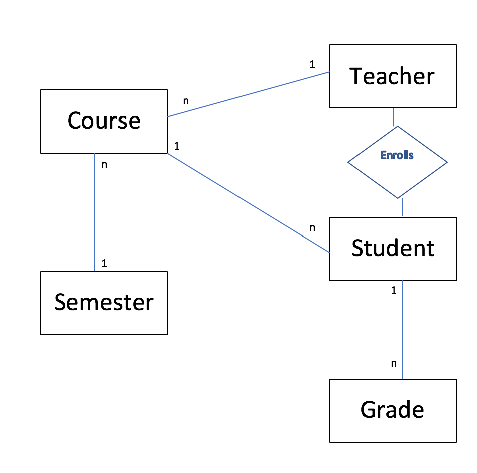

# Gradebook Application

After taking upon the challenge to make this application and picking up a new framework, I am now a big fan of Ruby on Rails.

### Start the application from scratch
`bundle && rake db:migrate && rails server`

If you want to reset and seed the database use
`rake db:reset && rake db:seed`

I will warn you that some constraints fail in the seed. User, grade, and enrollment models do not get seeded into the database. However, the seed file is a perfect place to find sample data for manually adding data. I recommend inputting in the order of the seed file.

(students->teachers->admin->semesters->courses->grades->enrollments)

You can add them with `rails console` or with the web interface.

### Relational Database Design

### Significant joins

Teacher gets a list of students with grades for a given course.
`User.joins(enrollment: [{course: :grade}]).where('courses.user_id'=>current_user).distinct`
In SQL:
`"SELECT DISTINCT \"users\".* FROM \"users\" INNER JOIN \"enrollments\" ON \"enrollments\".\"user_id\" = \"users\".\"id\" INNER JOIN \"courses\" ON \"courses\".\"id\" = \"enrollments\".\"course_id\" INNER JOIN \"grades\" ON \"grades\".\"course_id\" = \"courses\".\"id\" WHERE (courses.user_id=5)"`

Student sees courses and corresponding grades he is registered with.
`User.joins(grade: :course).where('users.id'=>current_user).distinct`

In SQL:
`"SELECT DISTINCT \"users\".* FROM \"users\" INNER JOIN \"grades\" ON \"grades\".\"user_id\" = \"users\".\"id\" INNER JOIN \"courses\" ON \"courses\".\"id\" = \"grades\".\"course_id\" WHERE (users.id=1)"`

Teacher views student roster and corresponding grades for a given course.
`User.joins(grade: :course).where('courses.id'=> @course.id).distinct`
In SQL:
`"SELECT DISTINCT \"users\".* FROM \"users\" INNER JOIN \"grades\" ON \"grades\".\"user_id\" = \"users\".\"id\" INNER JOIN \"courses\" ON \"courses\".\"id\" = \"grades\".\"course_id\" WHERE (courses.id=1)"`

Administrator views enrollment count for all courses in a given semester.  
`Semester.joins(enrollment: :course).distinct`
In SQL:
`"SELECT DISTINCT \"semesters\".* FROM \"semesters\" INNER JOIN \"enrollments\" ON \"enrollments\".\"semester_id\" = \"semesters\".\"id\" INNER JOIN \"courses\" ON \"courses\".\"id\" = \"enrollments\".\"course_id\""`

Administrator has access to get average gpa for all courses
`Course.joins(:grade).distinct`
In SQL:
`SELECT DISTINCT \"courses\".* FROM \"courses\" INNER JOIN \"grades\" ON \"grades\".\"course_id\" = \"courses\".\"id\""`

### Challenges

It took me awhile for accessing joins with templates. That was difficult. Even though this is mostly a front end issue, I would like to know best practice on accessing association attributes with the ORM. Overall. I enjoyed picking up Ruby on Rails. It makes implementing REST APIs that communicate with relational databases very convenient.
